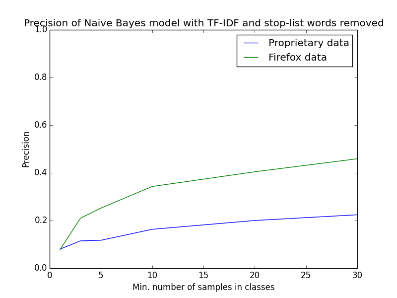
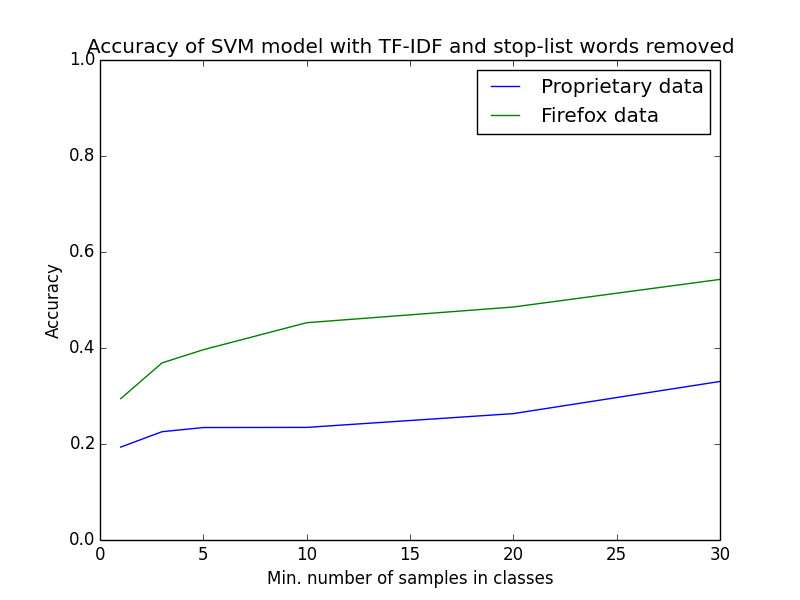
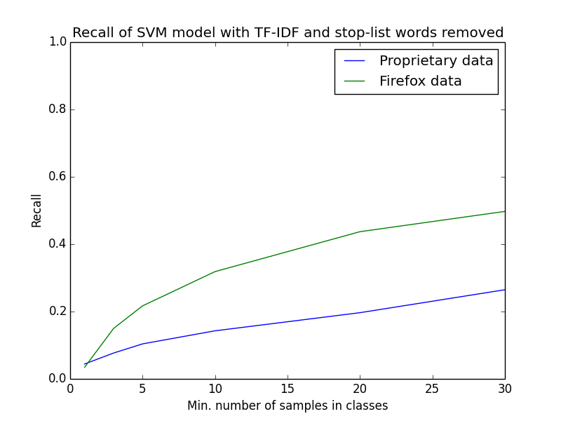

# Comparison of Open Source data with Proprietary data

To create a baseline for comparison of my models and data, I downloaded data from a public open source issue-tracking system, Mozilla Firefox data from Bugzilla system in particular. I removed bugs that were created before 2010, that were not in status RESOLVED with resolution FIXED and that were not labeled (i.e. unassigned). This resulted in a dataset with 9114 bugs in total. As I have only about 2200 of bugs in the proprietary dataset, I used only an adequate fraction of Firefox data for comparison.

I divided the data by ratio of 7:10 for simple cross-validation and the metrics that are used are accuracy and macro-averaged precision and recall. The data are compared by two models. The first is a Naive Bayes model with TF-IDF weighing and stop words removed. The second is a Support Vector Machine model with the same feature selection (TF-IDF and stop words) and with Gaussian kernel. For both models, I also discarded bugs that are assigned to a developer who was not assigned at least *x* bugs, where *x* is subsequently assigned to 1, 3, 5, 10, 20 and 30. From the results I plotted 6 graphs.

## Results

First graph represents accuracy of the Naive Bayes model. You can already see that the open source data perform better than the proprietary data. Accuracy of the classifier is **35 %** vs **24 %** when *x* (see above) is set to 30. In following text, I will always compare results of this setting of parameter *x* as I believe that is the most probable production value for the given size of the dataset at this point.

Second graph is a representation of precision of the same model. Precision of the classifier is **46 %** and **22 %** for the open source and proprietary data, respectively.

This graph shows recall of the Naive Bayes model. Recall value is **29 %** for the open source data and **19 %** for the proprietary data.

Fourth graph visualizes accuracy of the second model (SVM). Even with this model, the open source data perform much better with accuracy value of **54 %** vs **33 %** of the proprietary data.

Precision of the SVM model is pictured on this graph. It again clearly shows that the precision value of the open source data is higher (again about **54 %**) than the precision value of the proprietary data (**32 %**).

Last graph shows the recall of the same model. On the open source data, the classifier achieved recall value of **49 %** and on the proprietary data **26 %**.

## Conclusion
There are two possible conclusion from these results. Either the proprietary data are worse than the open source data, or I am processing them wrong.

I also learned two new interesting facts when preparing this comparison. Firstly, more data is not necessarily better than less. It depends on how long a period it took to create the data. For example, data that was created in a period of 5 years is worse than data created in a period of only 2 years, possibly significantly. This is possibly caused by developers leaving and entering a project. Thus it can be better to always train the classifier on data from 2 year period instead of training it on all data. Secondly, it is important to randomly shuffle data that are to be used for training of the classifier and subsequent cross-validation. I was able to achieve **6 %** better performance of the classifier on the proprietary simply by shuffling the data beforehand. This is probably caused by the same phenomenon.

This could possibly be the cause of poorer performance of the proprietary data as it was created in the period of about 4 years, whereas the selected fraction of the open source data was created in a period of only 1 and a half years. Further investigation should reveal if that is the case.